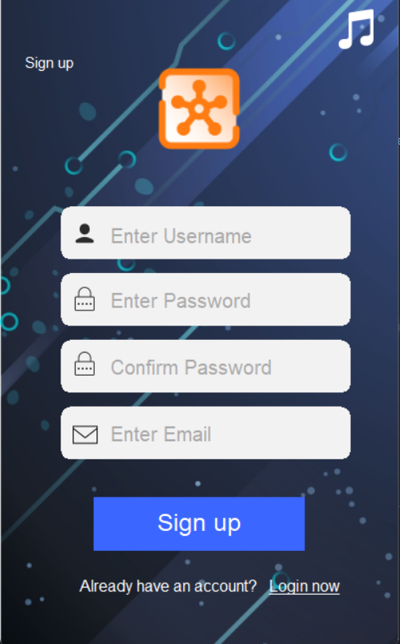
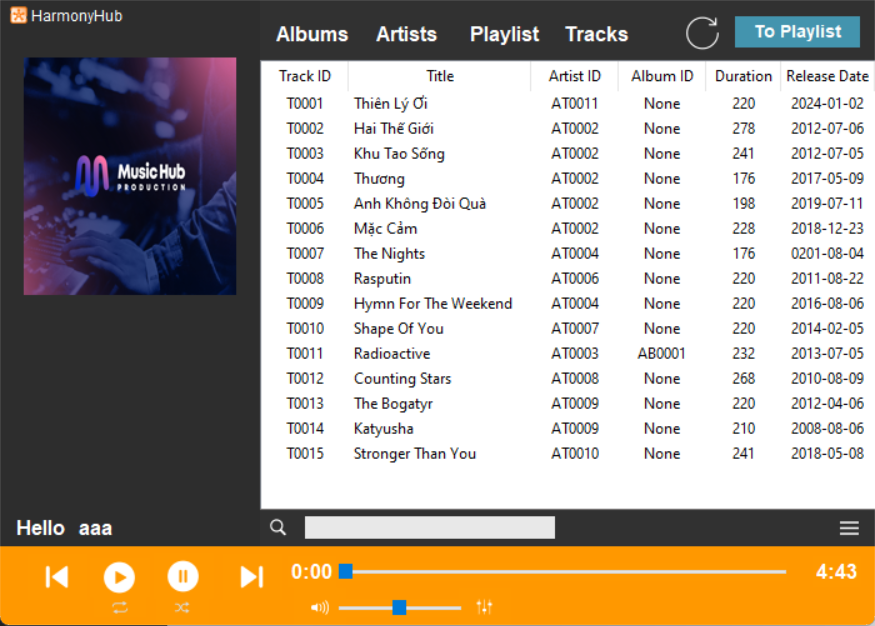

# HarmonyHub - A Music Streaming App

 

Introducing HarmonyHub , your gateway to a harmonious world of music streaming. Designed to elevate your auditory experience, HarmonyHub seamlessly integrates your favorite streaming platforms into one intuitive app, offering a unified interface for all your musical desires. HarmonyHub empowers you to discover, create, and indulge in the perfect soundtrack for every moment.

# Getting Started
These instructions will give you a copy of the project up and running on your local machine for development and testing purposes. See deployment for notes on deploying the project on a live system.

# Installing

- HarmonyHub required [python](https://www.python.org) 3.8+ to run

Installing the required library :
## Pillow
        pip install pillow
## tKinter
        pip install tk
## mutagen
        pip install mutagen
## Pygame
        pip install pygame
## MySQL Connector
        pip install mysql-connector-python
# How to run
- You need to change the host_ip in `Admin.py` , `Login.py` , `Signup.py` , `gui.py` to your network ip
- You can find your netword ip by going to CMD and type `ipconfig` . Find `ipv4` of either `Ethernet` or `Wireless Lan`
- For Example the default value is `localhost` or `127.0.0.1` . You need to change to `192.168.0.1`
- For `Client Usage` : Run file `Login.py` in `GUI` folder
- For `Admin Usage` : Run file `Admin.py` in `GUI` folder
> Warning : You need to run the server first in the `Admin Panel` before any client usage
# Screenshots
- **Login**
  

- **Sign up**
  

- **Main GUI**

- **Admin Panel**

.png)
# License
**MIT**
